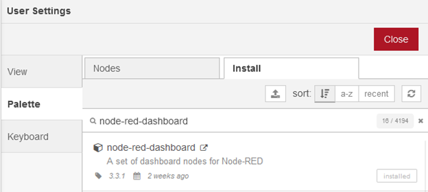

# NodeRED Install

NodeJS is a JavaScript runtime. This means that it allows JavaScript software to run outside of the web browser and have access to the filesystem and other computing resources. NodeJS is a prerequisite to installing NodeRED, which is a graphical data-driven programming environment that can be used to rapidly build and deploy IoT applications and dashboards.

Navigate to the following url:



<figure><figcaption></figcaption></figure>

Select the correct installer for your operating system.

<figure><figcaption></figcaption></figure>

Have it automatically install the necessary tools and press Install.

&#x20;

<div>

<figure><figcaption></figcaption></figure>

 

<figure><figcaption></figcaption></figure>

</div>

Allow the additional tools to install. This may take 2 minutes.

<figure><figcaption></figcaption></figure>

To verify that it has been installed correctly, using the Start Button, search for PowerShell.

<figure><figcaption></figcaption></figure>

Run the node command with the version flag to echo out the current installed version of NodeJS.

```powershell
node --version
```

<figure><figcaption></figcaption></figure>

NodeRED will be installed by NPM. NPM is an acronym for Node Package Manager. When programming, sometimes different programs need to use to the same libraries or frameworks. A package manager ensures the same libraries are not installed twice, they remain up-to-date, and they have the correct dependencies installed for them to work properly. NPM will be used to install NodeRED.

The official install documentation can be found here:

[https://nodered.org/docs/getting-started/windows](https://nodered.org/docs/getting-started/windows)

&#x20;

Open Powershell.

Launch PowerShell as Administrator.

<figure><figcaption></figcaption></figure>

Use the following command to change the execution policy.

```powershell
Set-ExecutionPolicy -ExecutionPolicy RemoteSigned    
```

<figure><figcaption></figcaption></figure>

Next, re-open Powershell as a normal user.

<figure><figcaption></figcaption></figure>

Check to ensure that NPM has been installed correctly.

_npm --version_

<figure><figcaption></figcaption></figure>

Install NodeRED using the following command:

```powershell
npm install -g --unsafe-perm node-red
```

<figure><figcaption></figcaption></figure>

To start NodeRED, use the following command:

```powershell
node-red
```

<figure><figcaption></figcaption></figure>

Notice the line Server now running at…

Type that IP address into your web browser. Do not close this terminal window until you are done using NodeRED. Ensure that you see the Welcome to Node-RED screen.

<figure><figcaption></figcaption></figure>

To safely close NodeRED, open the Powershell window and press CTRL + C.


